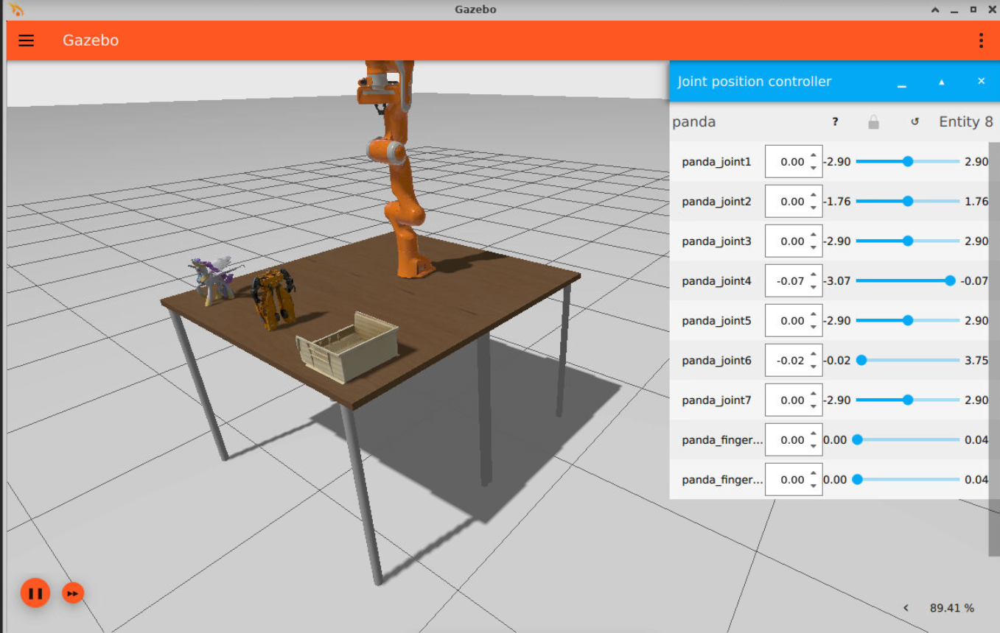

# Pilot02 Digital Twin Gazebo Simulator

This repository contains a Docker-based version of the Gazebo Simulator ([https://github.com/gazebosim/gz-sim](https://github.com/gazebosim/gz-sim)), which includes NoVNC web services for visualization. By running this container, users can access the Gazebo Simulator's graphical interface through a web browser at [http://localhost:6080/vnc.html](http://localhost:6080/vnc.html), providing an easy way to interact with simulations remotely using a VNC viewer or through the NoVNC web interface. The container also allows for configuring the simulation environment and launching different Gazebo worlds or robots by specifying launch files and adjusting the container's environment variables.

Gazebo Sim is an open-source robotics simulator that offers high-fidelity physics, rendering, and sensor models, providing a realistic environment for robotics research and development. It supports multiple points of entry for interaction, including a graphical user interface, plugins, and asynchronous message passing, giving users and developers flexibility in controlling simulations. Derived from over 16 years of development, Gazebo Sim enables advanced dynamics simulations, 3D graphics, and various sensor models like cameras, laser range finders, and IMUs, making it a powerful tool for both academic and commercial robotics projects.

## Description

The repository includes the following components:
- Docker setup for easy containerization
- A Docker compose-based test environment for a simple model and world

## Guidelines for build and test the component 

### 1. **Build the Main Docker Image:**

In this step, we build the Docker image using the provided `Dockerfile`. The image is named `pilot02-digitaltwin-gazebo`.

```bash
cd gazebo
docker build -t pilot02-digitaltwin-gazebo .
```
Make sure the path to your configuration file is correctly mapped to the Docker container.

### 2. **Run the ROS 2 Container:**

After building the Docker image, you can run the container using the following command:

```bash
docker run pilot02-digitaltwin-gazebo
```

### 3. **Build and Run the test automation:**

Test automation is integrated by docker-compose file:

Run: 
```bash
docker-compose up --build
```
After execution, you will be able to see at [Localhost →](http://localhost:6080/vnc.html) the web based access to the gazebo environment. By default use '1234' as password.

Example of Gazebo environment:



Example of a simple AGV model and world:


## Contributing

Feel free to open issues or submit pull requests. Contributions are welcome!

## License

This project is licensed under Apache v2 License - see the [LICENSE](LICENSE) file for details.